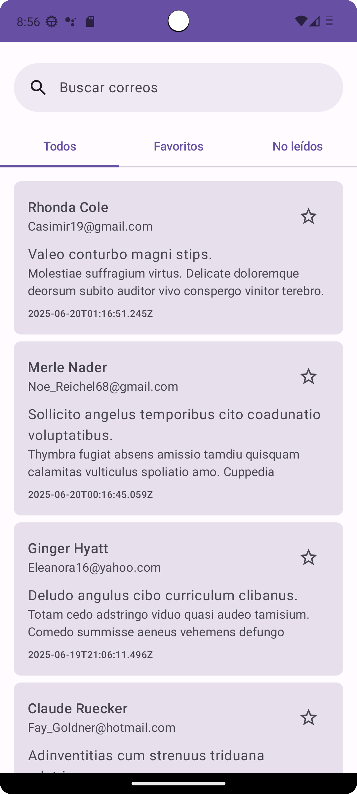
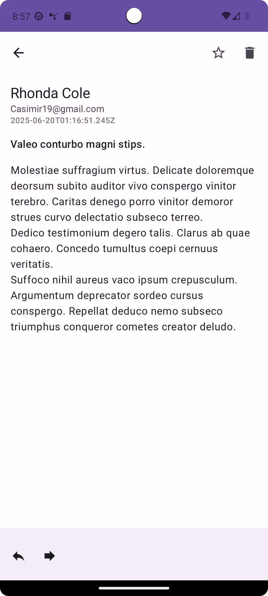
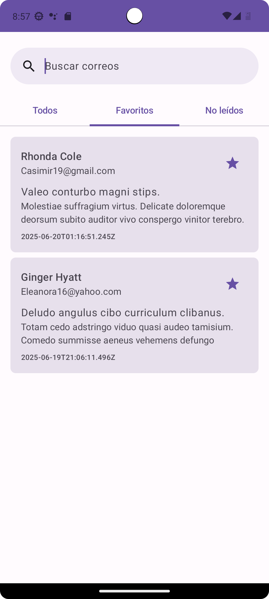

# Email Client App - Laboratorio 2 Computación Móvil

<div align="center">
  <h3>Universidad de Antioquia</h3>
  <p>Facultad de Ingeniería - Departamento de Ingeniería de Sistemas</p>
  <p>Computación Móvil - 2025-1</p>
</div>

## 📱 Descripción del Proyecto

Esta aplicación es una implementación moderna de un cliente de correo electrónico para Android, desarrollada como parte del Laboratorio 2 del curso de Computación Móvil. El proyecto se basa en el ejemplo "Reply" de Jetpack Compose Samples, pero ha sido significativamente modificado para incorporar funcionalidades adicionales y requisitos específicos del laboratorio.

## 🚀 Características Principales

- **Sincronización en Segundo Plano**: Implementación de WorkManager para sincronización periódica de correos.
- **Integración con API REST**: Consumo de servicios web mediante Retrofit y Moshi.
- **Almacenamiento Local**: Base de datos Room para persistencia de datos.
- **Interfaz Moderna**: UI completamente construida con Jetpack Compose.
- **Navegación**: Implementación del módulo Navigation de Compose.
- **Funcionalidades de Correo**:
  - Lista y detalle de correos
  - Marcado de favoritos
  - Sistema de lectura/no leído
  - Búsqueda de correos
  - Filtros por categorías

## 🛠️ Tecnologías Utilizadas

- **Jetpack Compose**: Framework moderno de UI
- **Kotlin**: Lenguaje de programación principal
- **Coroutines & Flow**: Para operaciones asíncronas
- **WorkManager**: Para tareas en segundo plano
- **Room**: Base de datos local
- **Retrofit & Moshi**: Consumo de APIs REST
- **Material Design 3**: Diseño y componentes de UI
- **Navigation Compose**: Navegación entre pantallas

## 📋 Requisitos

- Android Studio Hedgehog | 2023.1.1
- Kotlin 1.9.0 o superior
- Java Development Kit 11
- Android SDK 34
- Dispositivo o emulador con Android 7.0 (API 24) o superior

## 🔧 Configuración del Proyecto

1. Clona el repositorio:

   ```bash
   git clone [URL_DEL_REPOSITORIO]
   ```

2. Abre el proyecto en Android Studio:

   - File → Open → [Ubicación del proyecto]
   - Espera a que se complete la sincronización de Gradle

3. Configura el archivo local.properties (si no existe):

   ```properties
   sdk.dir=[Ruta_de_tu_Android_SDK]
   ```

4. Ejecuta la aplicación:
   - Selecciona un dispositivo o emulador
   - Click en Run 'Lab1-UI' (⇧F10)

## 🌐 API REST (MockAPI)

La aplicación utiliza MockAPI para simular un servidor de correos electrónicos. Los endpoints disponibles son:

- **Base URL**: `https://685503706a6ef0ed6630e738.mockapi.io/emails-api`
- **Endpoints**:
  - GET `/emails` - Obtener lista de correos
  - GET `/emails/:id` - Obtener un correo específico
  - PUT `/emails/:id` - Actualizar un correo (marcar como leído/favorito)

Estructura de los datos:

```json
{
  "id": "string",
  "senderName": "string",
  "senderEmail": "string",
  "subject": "string",
  "body": "string",
  "createdAt": "string",
  "isRead": boolean,
  "isStarred": boolean
}
```

## 📱 Capturas de Pantalla

### Vista Principal


_Lista principal de correos electrónicos con navegación y búsqueda_

### Detalle de Correo


_Vista detallada de un correo electrónico_

### Correos Favoritos


_Vista filtrada de correos marcados como favoritos_

Las capturas de pantalla muestran las principales funcionalidades de la aplicación:

- Interfaz moderna con Material Design 3
- Navegación intuitiva
- Sistema de favoritos
- Vista detallada de correos
- Diseño responsive

## 🏗️ Arquitectura

El proyecto sigue una arquitectura MVVM (Model-View-ViewModel) con los siguientes componentes:

```
app/
├── data/
│   ├── local/          # Base de datos Room y DAOs
│   ├── model/          # Modelos de datos
│   ├── remote/         # Servicios de API
│   └── repository/     # Repositorios
├── ui/
│   ├── components/     # Componentes reutilizables
│   ├── navigation/     # Configuración de navegación
│   ├── screens/        # Pantallas de la aplicación
│   └── theme/          # Estilos y temas
└── worker/            # Workers para tareas en segundo plano
```

## 🔄 Flujo de Datos

1. **Sincronización**:

   - WorkManager ejecuta EmailSyncWorker periódicamente
   - El worker obtiene datos de la API REST
   - Los datos se almacenan en la base de datos local
   - La UI se actualiza automáticamente mediante Flow

2. **Interacción del Usuario**:
   - Las acciones del usuario son manejadas por el ViewModel
   - Los cambios se reflejan en la base de datos local
   - La UI se actualiza mediante StateFlow

## 👥 Autores

- [[Sebastian Aristizabal ](https://github.com/sebudea)]
- [[Alejandro Arias ](https://github.com/AlejoAriasO)]
- [[Alejandro Cifuentes](https://github.com/cifu0426)]

## 📄 Licencia

Este proyecto está bajo la Licencia MIT - ver el archivo [LICENSE.md](LICENSE.md) para más detalles.

## 🙏 Agradecimientos

- Basado en el ejemplo [Reply](https://github.com/android/compose-samples) de Android
- Universidad de Antioquia
- Profesor del curso
- Compañeros de clase por su feedback

---

<div align="center">
  <p>Desarrollado con ❤️ para el curso de Computación Móvil</p>
  <p>Universidad de Antioquia - 2025-1</p>
</div>
